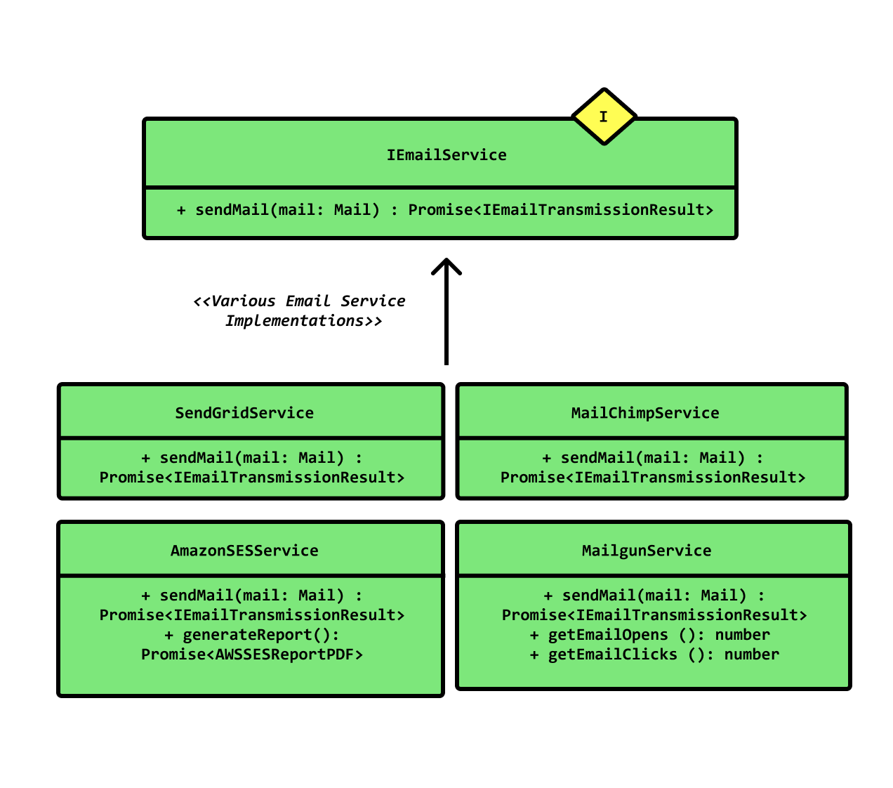

## Email Service example
### Description

Let's say that our boss told us that he wanted us to use **SendGrid** for sending emails.\
So we went and coded out a concrete `SendGridService` class, connecting to the Sendgrid API.

```typescript
class SendGridService {
  constructor (sendgridInstance) {
    this.sg = sendgridInstance;
  }

  sendMail (from, to, body) {
    // format the mail object to the sendgrid api shape
    // send it
    // create a result object 
    // return the result (success, failure, bounded, etc)
  }
}
```

After few time  he tells us that he wants us to use **MailChimp** instead because SendGrid is too expensive.

### Bad OCP implementation
We do and code a new `MailChimpService` class. But to use it we have to change lot of code to use his functions.

### Good OCP implementation
We can use the **Open-Closed Principle** to solve this problem.\
We could define an ***interface*** that specifies what a mail service can do, and leave the actual implementation to be figured out separately.


